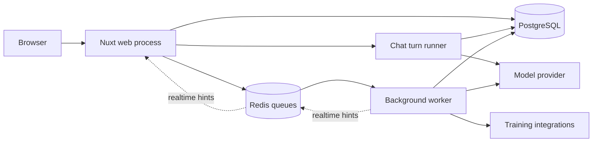

# Reliability design for the personal fork

## Runtime and ownership

Coach Watts is a Nuxt application with PostgreSQL as the source of truth. Its two
execution paths have different lifetimes:

- Interactive chat is persisted as `ChatTurn` records. A runner in the web process
  claims turns, executes the model and tools, records progress, and recovers stale
  turns. A separate BullMQ worker is not needed to answer ordinary chat messages.
- Workout generation, analysis, integration ingestion, and scheduled coaching jobs
  run through `task-dispatcher.ts`. The Redis driver adds jobs to `mainTaskQueue`;
  `cli/worker/start.ts` consumes them. The same worker process also consumes webhook,
  ping, and workout-stream queues and registers recurring jobs.

Redis is a queue dependency in this deployment, not merely a cache. It also
carries cross-process realtime notifications. Optional image caching is another use.
PostgreSQL stores the coaching data and chat history; Redis stores pending BullMQ
jobs and their execution state. Database backups alone do not preserve pending jobs.
The local Compose file mounts Redis data but does not configure periodic snapshots;
that volume alone does not guarantee pending jobs survive a Redis crash.

## Failure boundaries

An HTTP success when adding a job proves only that Redis accepted it. It does not
prove a consumer is running. Previously `pnpm dev` started only Nuxt, leaving the
background worker to a second terminal. A healthy database and Redis could therefore
coexist with a workout that never started generating. Monitoring also checked only
webhook, stream, and ping consumers, missing the queue used by coaching tasks.

The development launcher should own both web and worker lifecycles, restart a failed
worker with backoff, and stop its children when the developer exits. Separate worker
deployment remains useful for production scaling; it must have its own process
supervisor. Docker infrastructure uses `restart: unless-stopped`; healthchecks make
readiness visible. Docker restart policies restart exited containers, not containers
that merely report unhealthy.

`/api/health` is a database/web liveness check. The protected
`/api/monitoring/worker` endpoint is the background-work readiness check. It includes
`queues.mainTasks` and reports HTTP 503 if the Redis task driver has no coaching
consumer or its queue is paused, even if webhook workers are healthy. Its consumer
count is a point-in-time signal, not a guarantee that a particular task will finish.

User actions must receive a bounded response when work cannot start, and generation
must reach a visible success or failure state. Persisted state is authoritative;
WebSocket and Redis notifications are refresh hints. Losing a notification must not
leave a screen waiting forever. Recovery must not repeat an already completed tool
mutation or permit an abandoned job to overwrite newer user intent.

## Simplification decisions

Keep one supported local startup path and one explicit task driver per deployment.
The current Redis worker executes the existing canonical task functions from
`trigger/`; Trigger.dev is an alternative execution service, not a second service
that a local Redis deployment needs to run. Its SDK still supplies task metadata, so
removing its dependency without first extracting those definitions would break the
worker. Choose `TASK_QUEUE_DRIVER=redis` explicitly for this deployment rather than
letting incidental Trigger credentials select a backend.

Do not use the current `inline` driver as a production failover. It keeps run records
in process memory and does not provide the durable scheduling and recovery of a
queue. An automatic fallback after an ambiguous enqueue failure can also execute a
mutation twice. The correct response to an unavailable queue is an actionable error
or durable recovery, not an untracked background promise.

Deleting Redis immediately would replace working queue mechanisms while diagnosing
failures in task admission, execution, and UI reconciliation. Retain it for this
repair, automate its operation, and keep its outage from trapping interactive chat.
The goal is fewer manual services to manage and predictable completion, not merely
fewer packages in `package.json`.

## Boundary for a future PostgreSQL-only deployment

A PostgreSQL-backed job runner could eventually share the durable-claim approach
already used by chat and remove Redis from a single-instance personal deployment.
That migration needs a job table with idempotency, atomic claims and leases, bounded
retries, cancellation, scheduling, and persisted results. It must port all four
queues and existing pending jobs before retiring the Redis consumer. Integration
webhooks require durable acceptance even while a worker is offline.

Keep that change behind the task-dispatch interface. Extract canonical task functions
and metadata from Trigger wrappers first, retain a compatible run-status API, then
migrate producers and consumers together. Realtime can use local delivery and
database reconciliation for one web process; multiple web processes would still
need an explicit cross-process notification transport. This is a separate migration
with failure/restart tests, not a safe switch to flip during a usability repair.
